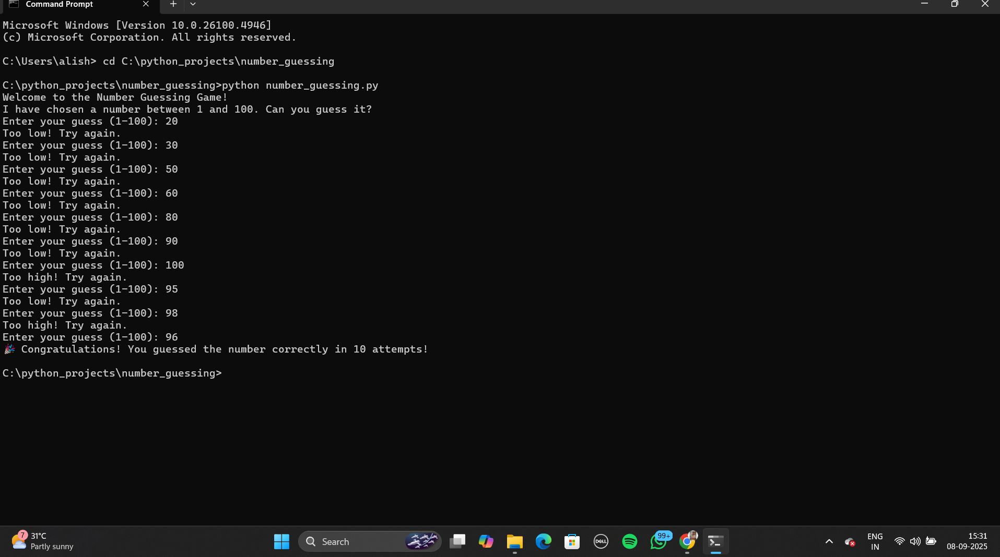

# 🎮 Number Guessing Game

A simple Python project where the computer picks a random number between 1 and 100, and the player has to guess it.  
The program gives hints (`Too high!` / `Too low!`) until the correct number is guessed.  


## How to Run
```bash```
python number_guessing.py


## Features
- Random number between 1–100  
- Validates user input  
- Tracks number of attempts

   
## Demo


